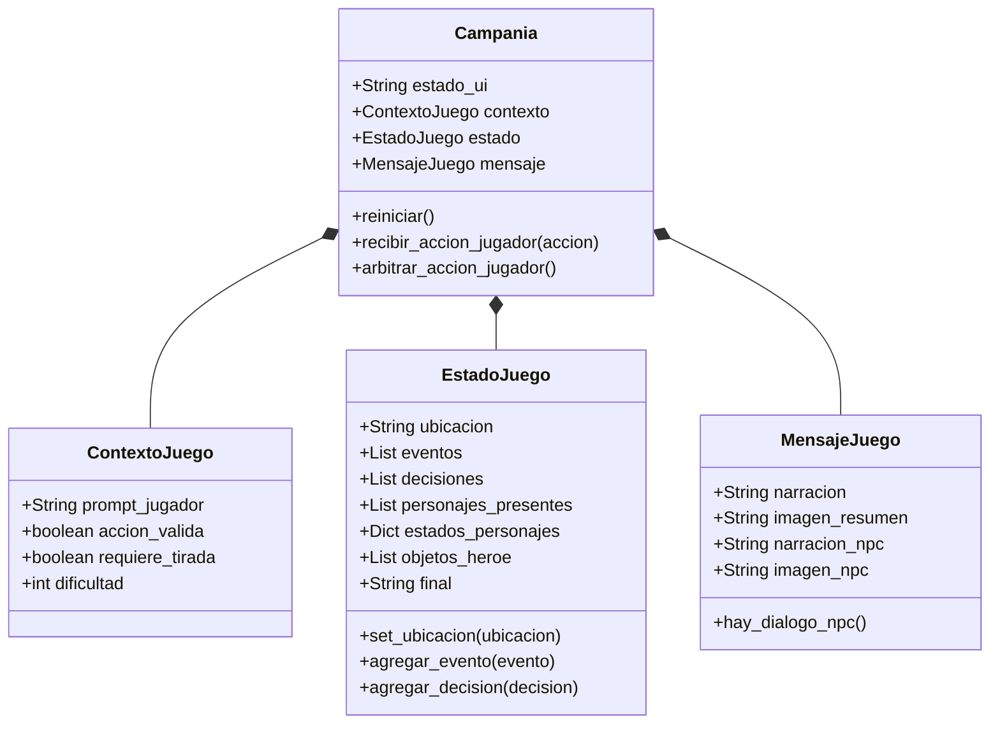
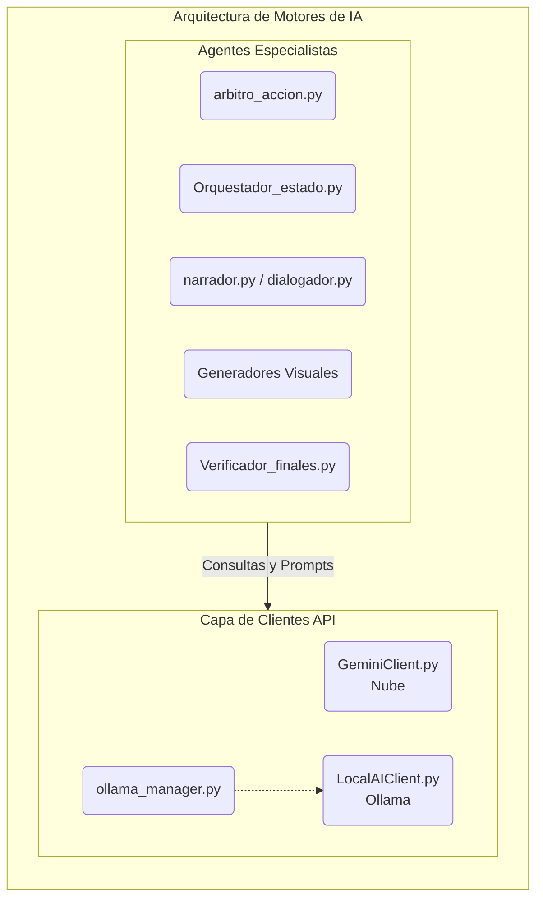

# DM-ai

## ¿Por qué DM-ai y qué propongo?
DM-ai es un prototipo de Director de Juego (DM) basado en inteligencia artificial, diseñado para ofrecer una experiencia de rol narrativo inspirada en Dungeons and Dragons. 

Los juegos de rol clásicos ofrecen una libertad de acción inigualable. Si bien videojuegos como *Baldur's Gate 3* logran capturar parte de esta magia, siguen limitados por un conjunto finito de acciones y caminos predefinidos. Por otro lado, aunque los modelos de lenguaje actuales permiten generar historias dinámicas (como en FableAI), carecen de mecanismos formales para resolver acciones puntuales (como una tirada de d20) y les cuesta mantener un estado coherente y persistente del mundo a lo largo de una campaña. A esto se le suma la dificultad habitual de coordinar los horarios de varios jugadores para mantener partidas presenciales.

Frente a estas limitaciones, propongo DM-ai: un sistema capaz de administrar el estado de la partida, interpretar las acciones del jugador y resolver sus consecuencias mediante un sistema basado en reglas y tiradas de dados. Mi objetivo es lograr una narración interactiva consistente, utilizando estructuras JSON para coordinar la comunicación interna, y modelos de lenguaje (tanto locales como en la nube, según se prefiera) para dar vida a una verdadera experiencia de rol sin las restricciones de las historias pre-programadas.

## Requisitos antes de jugar
Para poder ejecutar el juego en tu computadora, especialmente si lo haces por primera vez, necesitas tener instalados dos programas fundamentales. Los archivos ejecutables del juego (como `Jugar_Windows.bat` o `Jugar_Linux.sh`) están preparados para facilitarte el resto del proceso.

### 1. Python
El juego está programado en Python, por lo que es necesario tenerlo instalado en tu sistema.
* **Descarga:** Puedes descargarlo de forma gratuita desde su página oficial: [python.org/downloads](https://www.python.org/downloads/).
* **⚠️ Instalación en Windows:** Es **crítico** que, al iniciar el instalador de Python, te asegures de marcar la casilla inferior que dice **"Add Python to PATH"** (Agregar Python al PATH). Si omites este paso, los archivos ejecutables no podrán detectar Python y el juego no abrirá.

### 2. Ollama
Ollama es el motor que permite ejecutar modelos de Inteligencia Artificial de forma local en tu computadora, lo cual es necesario para la generación de la historia del juego.
* **Descarga e Instalación:** Descárgalo desde su web oficial: [ollama.com/download](https://ollama.com/download).
* **Uso:** Instálalo y asegúrate de abrir el programa para que quede activo en tu computadora. Debe estar ejecutándose en segundo plano para que el juego pueda generar el texto y comunicarse con la IA.
* **Recomendación de Modelo:** Te recomendamos descargar el modelo **Llama 3.1**, ya que es el que estamos utilizando por defecto para este proyecto. Una vez instalado Ollama, abre una terminal o símbolo del sistema y ejecuta el comando `ollama run llama3.1` para descargarlo automáticamente.

### ¿Cómo iniciar el juego?
Una vez que tengas **Python** y **Ollama** instalados, ve a la carpeta del juego y ejecuta el archivo correspondiente a tu sistema operativo (por ejemplo, `Jugar_Windows.bat` si usas Windows).
La primera vez que lo ejecutes, el script detectará que te faltan las librerías del juego (como Pygame) y te preguntará: `¿Deseas crear el entorno virtual e instalar las dependencias de Python? (s/n):`.
Escribe **`s`** y presiona Enter. El script creará un entorno seguro (entorno virtual) e instalará todo lo necesario de forma completamente automática, para luego iniciar el juego.

## Herramientas Elegidas
Para el desarrollo de DM-ai he seleccionado un conjunto de tecnologías robustas y eficientes que permiten construir todo el sistema, desde la lógica hasta la interfaz gráfica interactiva:
- **Python**: Como lenguaje de programación principal, gracias a su inmenso ecosistema de librerías para IA y su facilidad para un desarrollo rápido.
- **Pygame**: Utilizado para construir toda la Vista (interfaz gráfica de usuario). Al ser un proyecto inspirado en videojuegos y juegos de rol, Pygame me permite manejar los eventos de ventana, renderizado de texto interactivo y controles visuales con mayor libertad que las librerías GUI tradicionales.
- **google-genai**: La librería oficial para integrar el modelo de Google Gemini directamente al proyecto. A través del cliente `GeminiClient`, esta librería maneja las solicitudes complejas hacia la IA en la nube.
- **huggingface-hub**: Para facilitar la interacción y posible descarga de modelos abiertos alojados en Hugging Face, sirviendo como un pilar importante para la inferencia local.
- **requests**: Una herramienta indispensable para realizar peticiones HTTP. La utilizo para la comunicación en red con las APIs y para el cliente `LocalAIClient`, permitiendo el paso de JSON de un lado a otro.
- **Pillow (PIL)**: Librería para el procesamiento de imágenes. Se utiliza en conjunto con la vista para manejar recursos gráficos, escalar imágenes o adaptar texturas necesarias dentro del renderizado de Pygame.
- **pyperclip**: Implementado para aportar usabilidad al sistema, permitiendo que el jugador o el DM puedan interactuar con el portapapeles (copiar/pegar) de manera fluida directamente desde la interfaz gráfica.
- **JSON**: La librería estándar de Python para el manejo y persistencia de la configuración del sistema (`config.json`), logrando que parámetros clave (como qué IA usar, u otros datos de entorno) sean fácilmente editables sin tocar el código fuente.

## Construcción del Modelo
La arquitectura del núcleo lógico (todo lo que reside en la carpeta `modelo`) está diseñada siguiendo principios de modularidad y bajo acoplamiento. He dividido el sistema en varios submódulos especializados para facilitar el mantenimiento y delegar responsabilidades específicas a distintos agentes:

### 1. Clases y Estructuras Base (`modelo/clases/` y `modelo/game/`)
Aquí residen las entidades que mantienen la persistencia, memoria y las reglas de negocio del juego.

- **Campania.py**: Es el cerebro organizador; mantiene el contexto de la partida activa, orquesta las llamadas a la IA y administra el flujo general del juego.
- **Estadojuego.py** y **ContextoJuego.py**: Almacenan y serializan (a JSON) los datos del mundo, los inventarios, estadísticas y salud de los personajes.
- **MensajeJuego.py**: Define de forma estándar la estructura de los diálogos y notificaciones que se enviarán a la Vista.
- **Submódulo `game/`**: Incluye archivos de soporte (`characters.py`, `items.py`, `campaign.py`) para definir y estructurar los atributos crudos de los actores, campañas y objetos.

### 2. Motores de Inteligencia Artificial (`modelo/ai/`)
Este es el motor de inferencia narrativa del DM, compuesto por clientes de red y varios "agentes" especialistas:

- **Clientes (`GeminiClient.py`, `LocalAIClient.py`)**: Se encargan de la comunicación directa con las APIs (Google en la nube y Ollama en local). El modelo local es administrado directamente por el módulo **`ollama_manager.py`**.
- **`Orquestador_estado.py`**: Define dinámicamente cuáles son las salidas o caminos posibles para el jugador basándose en el estado actual.
- **`narrador.py` y `dialogador.py`**: Generan la narrativa ambiental y estructuran las conversaciones de los NPCs, asegurando la inmersión rolera.
- **`arbitro_accion.py`**: Interpreta la acción del jugador para decidir si requiere una resolución de reglas (ej. tirada de d20) o si se resuelve narrativamente.
- **`Verificador_finales.py`**: Analiza en segundo plano si las condiciones impuestas para superar el escenario se han cumplido.
- **Generadores Visuales (`generador_imagen_escena.py`, `imagen_NPC.py`)**: Sub-agentes encargados de la creación de prompts gráficos para ilustrar las ubicaciones y personajes.

### 3. Herramientas ("Tool Calling") (`modelo/tools/`)
Para evitar que los modelos de lenguaje "alucinen" resoluciones mecánicas, he implementado funciones de código estricto que las IAs pueden invocar:
- **`dice.py`**: Ejecuta lógicamente las tiradas de dados (d20) y verifica si una acción es un éxito o un fracaso matemático basado en el estado.
- **`gen_state.py` y `gen_messege.py`**: Rutinas controladas para que la IA actualice atributos (vida, inventario) o emita alertas sin corromper el motor de juego.

### 4. Configuración (`modelo/configuracion.py`)
Módulo encargado de aislar la persistencia de los ajustes del usuario, leyendo y escribiendo en el `config.json` parámetros clave como el motor de IA seleccionado.

## Construcción de la Vista Gráfica
La interfaz gráfica de usuario (GUI) ha sido diseñada pensando en la usabilidad y la experiencia del usuario. Busca proporcionar un entorno limpio y directo donde el usuario pueda escribir sus prompts, configurar los parámetros del modelo en tiempo real y visualizar las respuestas de forma estructurada. La vista se comunica de forma asíncrona con los clientes de IA para mantener la aplicación receptiva incluso durante tiempos de inferencia prolongados.

## Demostración de Partida
A continuación, se muestra el flujo típico de una sesión de juego interactuando con el Director de Juego (DM):

### 1. Escena Inicial y Generación Visual
El DM nos sitúa en el contexto mediante una descripción narrativa detallada, acompañada de una imagen generada por IA que ilustra nuestra ubicación actual.

### 2. Resolución de Acciones (Tirada de d20)
Cuando intentamos una acción arriesgada (como atacar o escapar), el "Árbitro" interviene automáticamente y exige una tirada de dados virtual para determinar nuestro éxito.

### 3. Consecuencia Matemática (Resultado)
El motor calcula el resultado evaluando la dificultad y la tirada. A partir de este número, la IA describe narrativamente cómo nos fue (un fallo desastroso o un éxito épico).

### 4. Interacción con NPCs
El sistema puede asumir la identidad de cualquier personaje, permitiendo diálogos inmersivos y mostrando el retrato del NPC con el que estamos conversando.

### 5. Evaluación de Objetivos
El Verificador de finales analiza en segundo plano nuestras acciones. Si detecta que hemos completado la misión (o muerto en el intento), nos alerta sobre el desenlace inminente.

### 6. Pantalla Final
La aventura concluye y se cierra la sesión tras resolver el desenlace de la historia.

## Trabajo Futuro
El proyecto se encuentra en constante evolución. Algunas de mis metas para futuras versiones incluyen:
- **Soporte para más proveedores de IA**: Integración con OpenAI, Anthropic y otras alternativas locales como Ollama.
- **Gestión avanzada de contexto y memoria**: Mejorar la capacidad del modelo para recordar conversaciones largas y mantener el contexto.
- **Mejoras en la Interfaz Gráfica**: Añadir soporte para temas (modo oscuro/claro), atajos de teclado y exportación de conversaciones a PDF/Markdown.
- **Procesamiento Multimodal**: Ampliar las capacidades para que el sistema pueda analizar y responder a imágenes y documentos, no solo a texto.
- **Optimización de Código**: Refactorizar y limpiar la base de código para reducir la latencia, especialmente en el manejo de peticiones locales y renderizado gráfico.
- **Mejoras en la Arquitectura**: Consolidar el patrón de diseño (como MVC) para lograr un mayor desacoplamiento entre la lógica del juego (modelo) y Pygame (vista), lo que facilitaría escalar el proyecto o incluso llevarlo a la web en el futuro.
