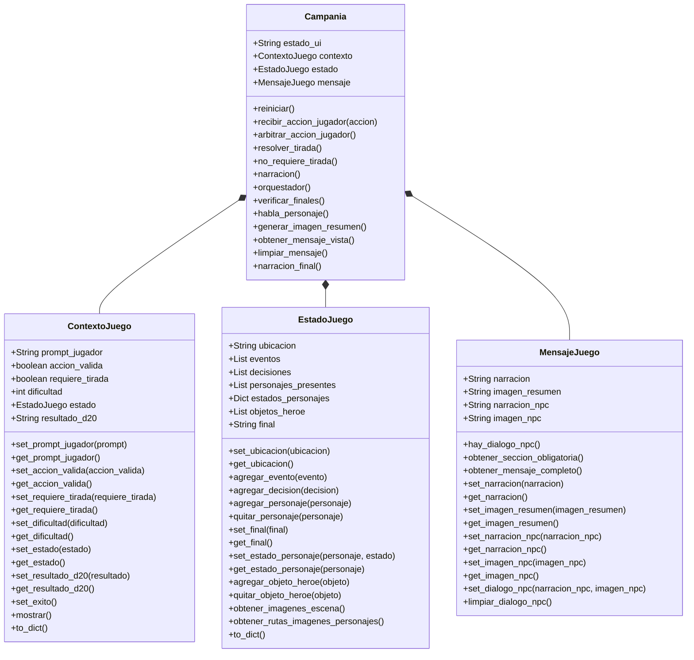
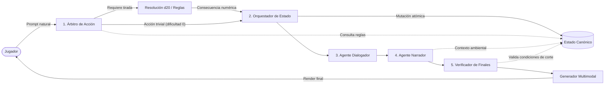
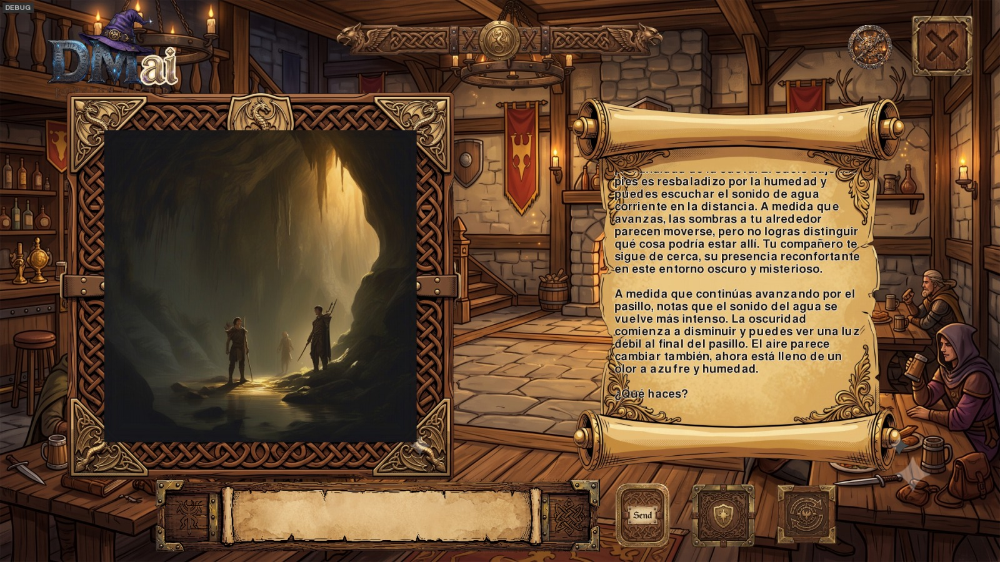
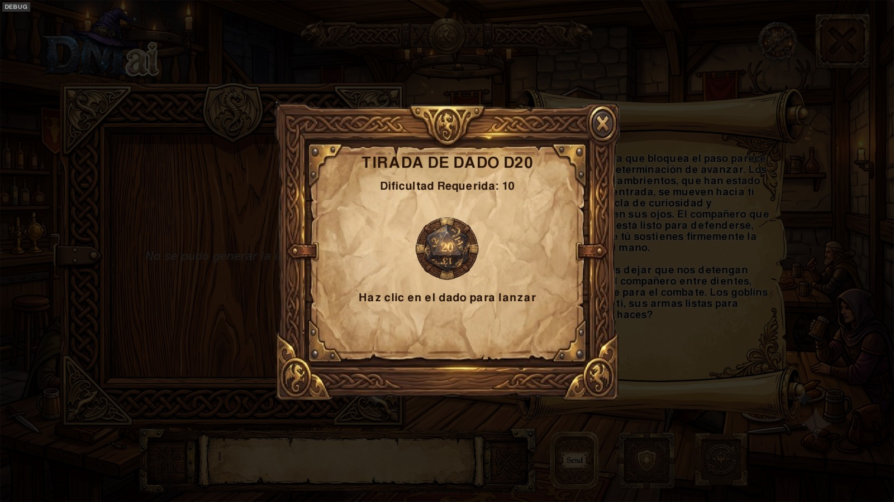
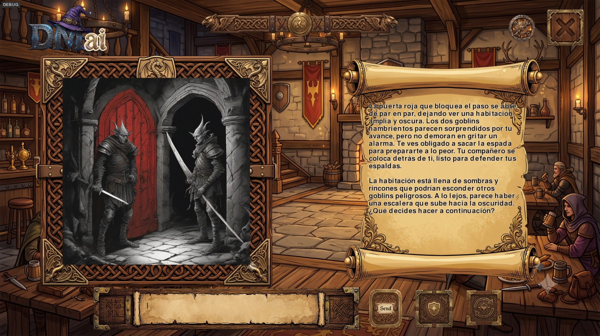
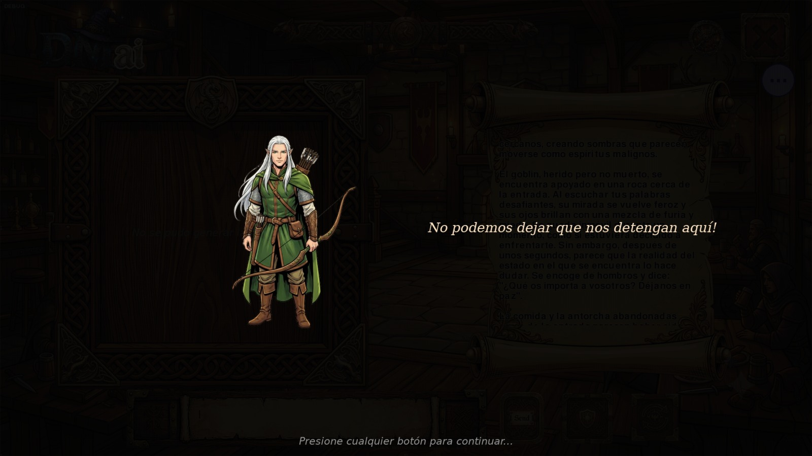
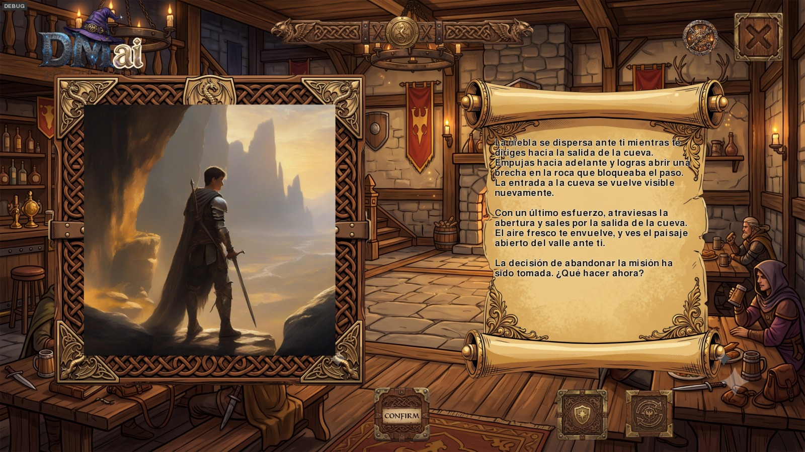
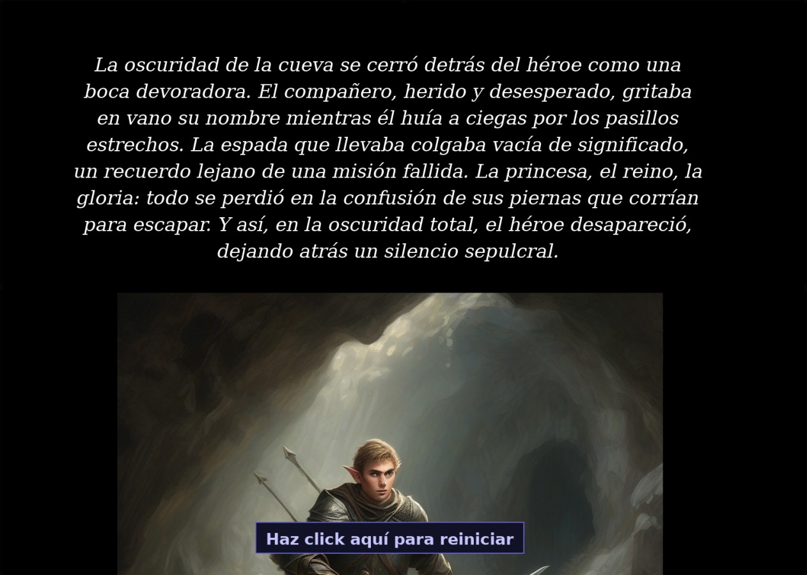

# DM-AI: Un Director de Juego Multiagente Basado en Modelos de Lenguaje para Juegos de Rol Narrativos

[-red.svg?logo=adobeacrobatreader&logoColor=white)](docs/paper/DM_AI_paper_CACIC.pdf)
[](https://www.python.org/)
[](https://www.pygame.org/)
[](https://ollama.com/)
[-yellow.svg?logo=huggingface&logoColor=white)](https://huggingface.co/)
[](#arquitectura-del-sistema)
[](https://www.unlu.edu.ar/)

> **Artículo y Repositorio Oficial de Investigación**  
> **Autores:** Salvador Baez, Juan Manuel Fernández  
> **Institución:** Universidad Nacional de Luján (UNLu), Buenos Aires, Argentina  
> **Contacto:** `totitobaez1011@gmail.com` | `jmfernandez@unlu.edu.ar`  
> **Marco:** Presentado en el *Congreso Argentino de Ciencias de la Computación (CACIC)*  
> 📄 **Leer Artículo Completo:** [`docs/paper/DM_AI_paper_CACIC.pdf`](docs/paper/DM_AI_paper_CACIC.pdf)

---

## Resumen

**DM-AI** es un director de juego automatizado para juegos de rol narrativos inspirados en *Dungeons & Dragons*. Los sistemas de narración interactiva basados puramente en modelos de lenguaje ofrecen libertad de acción, pero presentan dos problemas fundamentales: **no distinguen las acciones que requieren resolución mediante reglas formales ni preservan un estado consistente del mundo** (*state drift* y alucinaciones mecánicas).

Para resolver esta problemática, **DM-AI** descompone la dirección de la partida en una arquitectura de **cinco agentes especializados** (*arbitraje de acciones, actualización de estado, diálogo de personajes, narración y verificación de finales*) que se comunican mediante salidas estructuradas con esquemas de valores acotados. Las acciones del jugador se resuelven con tiradas de **d20**, cuya dificultad es propuesta por el modelo dentro de un conjunto discreto $\{0, 5, 10, 15, 20\}$ y revalidada estrictamente por el sistema fuera del LLM.

```
┌─────────────────┐       ┌────────────────────────┐       ┌─────────────────────┐
│  Acción Jugador │ ────> │ Árbitro & Tool Calling │ ────> │  Mutación de Estado │
│ (Lenguaje Libre)│       │ (Validación Mecánica)  │       │  (JSON Persistente) │
└─────────────────┘       └────────────────────────┘       └─────────────────────┘
                                                                      │
┌─────────────────┐       ┌────────────────────────┐                  │
│ Interfaz Pygame │ <──── │ Síntesis Narrativa &   │ <────────────────┘
│ (Texto + Img)   │       │ Generación Visual (HF) │
└─────────────────┘       └────────────────────────┘
```

---

## Contribuciones Principales

1. **Arquitectura Multi-Agente Desacoplada:** Separación explícita de responsabilidades cognitivas entre arbitraje de reglas, mutación de estado, diálogo de NPCs, síntesis literaria y monitoreo de terminación.
2. **Arbitraje Probabilístico Revalidado:** El modelo propone la dificultad de la acción dentro de un conjunto discreto $\{0, 5, 10, 15, 20\}$ (donde $0$ corresponde a acciones sin riesgo), y el motor en código ejecuta el lanzamiento d20 y aplica la comparación numérica fuera del modelo generativo.
3. **Muestreo Diferenciado por Temperatura:**
   - **Baja temperatura:** Para agentes que generan llamadas a herramientas (*tool calling*) y mutaciones estructuradas en JSON.
   - **Alta temperatura:** Para el agente narrador y generación creativa descriptiva.
4. **Ventana de Contexto y Memoria Deslizante:** Contexto de 8192 tokens con una memoria episódica acotada a los últimos cinco eventos y cinco decisiones para evitar saturación contextual.
5. **Documentación de la Tensión de Diseño:** Análisis empírico sobre el compromiso (*trade-off*) entre restringir alucinaciones del modelo mediante validación estricta y preservar la agencia y creatividad del jugador.

---

## Arquitectura del Sistema

### 1. Modelo de Datos y Estado Canónico (`modelo/clases/`)

El estado del mundo se preserva en estructuras serializables en JSON:


```mermaid
classDiagram
    class Campania {
        +String estado_ui
        +ContextoJuego contexto
        +EstadoJuego estado
        +MensajeJuego mensaje
        +reiniciar()
        +recibir_accion_jugador(accion)
        +arbitrar_accion_jugador()
        +resolver_tirada()
        +no_requiere_tirada()
        +narracion()
        +orquestador()
        +verificar_finales()
        +habla_personaje()
        +generar_imagen_resumen()
        +obtener_mensaje_vista()
        +limpiar_mensaje()
        +narracion_final()
    }

    class EstadoJuego {
        +String ubicacion
        +List eventos
        +List decisiones
        +List personajes_presentes
        +Dict estados_personajes
        +List objetos_heroe
        +String final
        +set_ubicacion(ubicacion)
        +get_ubicacion()
        +agregar_evento(evento)
        +agregar_decision(decision)
        +agregar_personaje(personaje)
        +quitar_personaje(personaje)
        +set_final(final)
        +get_final()
        +set_estado_personaje(personaje, estado)
        +get_estado_personaje(personaje)
        +agregar_objeto_heroe(objeto)
        +quitar_objeto_heroe(objeto)
        +obtener_imagenes_escena()
        +obtener_rutas_imagenes_personajes()
        +to_dict()
    }

    class ContextoJuego {
        +String prompt_jugador
        +boolean accion_valida
        +boolean requiere_tirada
        +int dificultad
        +EstadoJuego estado
        +String resultado_d20
        +set_prompt_jugador(prompt)
        +get_prompt_jugador()
        +set_accion_valida(accion_valida)
        +get_accion_valida()
        +set_requiere_tirada(requiere_tirada)
        +get_requiere_tirada()
        +set_dificultad(dificultad)
        +get_dificultad()
        +set_estado(estado)
        +get_estado()
        +set_resultado_d20(resultado)
        +get_resultado_d20()
        +set_exito()
        +mostrar()
        +to_dict()
    }

    class MensajeJuego {
        +String narracion
        +String imagen_resumen
        +String narracion_npc
        +String imagen_npc
        +hay_dialogo_npc()
        +obtener_seccion_obligatoria()
        +obtener_mensaje_completo()
        +set_narracion(narracion)
        +get_narracion()
        +set_imagen_resumen(imagen_resumen)
        +get_imagen_resumen()
        +set_narracion_npc(narracion_npc)
        +get_narracion_npc()
        +set_imagen_npc(imagen_npc)
        +get_imagen_npc()
        +set_dialogo_npc(narracion_npc, imagen_npc)
        +limpiar_dialogo_npc()
    }

    Campania *-- ContextoJuego
    Campania *-- EstadoJuego
    Campania *-- MensajeJuego
```

* **`Campania`**: Controlador central de flujo y orquestador del ciclo de evaluación por turnos (*Game Loop*).
* **`EstadoJuego`**: Registro canónico del entorno: inventario, ubicaciones, eventos registrados y salud.
* **`ContextoJuego`**: Buffer transaccional del turno actual (prompt del jugador, validez de acción, umbral de dificultad y resultado d20).
* **`MensajeJuego`**: Estructura de transferencia desacoplada hacia la capa de presentación (GUI).

---

### 2. Pipeline Cognitivo de los 5 Agentes (`modelo/ai/`)

El flujo por turnos canaliza la entrada del usuario a través de una secuencia de agentes especializados:


```mermaid
flowchart LR
    Jugador([Jugador])
    Arbitro[1. Árbitro de Acción]
    Tirada[Resolución d20 / Reglas]
    Orq[2. Orquestador de Estado]
    Dialogador[3. Agente Dialogador]
    Narrador[4. Agente Narrador]
    Verif[5. Verificador de Finales]
    GenVis[Generador Multimodal]
    Estado[(Estado Canónico)]

    Jugador -- Prompt natural --> Arbitro
    Arbitro -- Requiere tirada --> Tirada
    Tirada -- Consecuencia numérica --> Orq
    Arbitro -- Acción trivial (dificultad 0) --> Orq
    
    Orq -- Mutación atómica --> Estado
    Orq --> Dialogador
    Dialogador --> Narrador
    Narrador --> Verif
    Verif --> GenVis
    GenVis -- Render final --> Jugador

    Arbitro -. Consulta reglas .-> Estado
    Narrador -. Contexto ambiental .-> Estado
    Verif -. Valida condiciones de corte .-> Estado
```

#### Roles y Responsabilidades:

1. **Árbitro de Acción (`arbitro_accion.py`):** Analiza la intención semántica del jugador. Dictamina si la acción es ejecutable en el contexto actual y propone una dificultad discreta $\{0, 5, 10, 15, 20\}$.
2. **Resolución de Reglas (`modelo/tools/dice.py`):** Ejecuta en código determinístico el lanzamiento d20 y compara el valor contra la dificultad validada.
3. **Orquestador de Estado (`Orquestador_estado.py`):** Recibe el desenlace matemático y aplica mutaciones atómicas sobre el estado (vida, inventario, transiciones de sala).
4. **Dialogador de NPCs (`dialogador.py`):** Asume el rol y personalidad de personajes no jugadores presentes en la escena.
5. **Narrador (`narrador.py`):** Produce la descripción sensorial y literaria del turno unificando las consecuencias mecánicas y los diálogos.
6. **Verificador de Finales (`Verificador_finales.py`):** Comprueba silenciosamente si el estado cumple condiciones de victoria, derrota o desenlaces especiales.
7. **Generador Multimodal (`generador_imagen_escena.py`, `imagen_NPC.py`):** Sintetiza visualmente la escena mediante *Stable Diffusion XL* vía Hugging Face Hub o Gemini.

---

## Stack Tecnológico

| Capa / Componente | Tecnología | Justificación Técnica |
| :--- | :--- | :--- |
| **Lenguaje Core** | Python 3.10+ | Ecosistema estándar en IA, procesamiento simbólico y concurrencia. |
| **Interfaz Gráfica (GUI)** | Pygame 2.x | Control fino sobre el loop de eventos, renderizado asíncrono y texturas personalizadas. |
| **Inferencia Local** | Ollama Engine | Inferencia offline sobre arquitecturas cuantizadas (Llama 3.1 8B). |
| **Inferencia Cloud** | Google Gemini API (`google-genai`) | Solicitudes complejas de razonamiento y soporte multimodal alternativo. |
| **Generación Visual** | Hugging Face Hub (`stabilityai/sdxl`) | Renderizado de imágenes de escena sin costo de APIs propietarias. |
| **Manipulación Gráfica** | Pillow (PIL) | Procesamiento y adaptación dinámica de texturas en tiempo de ejecución. |
| **Persistencia** | JSON Schema | Serialización atómica y auditable del estado del mundo. |

---

## Demostración y Validación Experimental

El sistema fue validado sobre una campaña experimental de **tres escenarios encadenados, cinco personajes y cinco finales alcanzables**:

| 1. Inicio de Aventura y Renderizado de Escena | 2. Detección de Riesgo y Arbitraje d20 |
| :---: | :---: |
|  |  |
| *Síntesis contextual inicial ilustrada con modelo de difusión.* | *El Árbitro detecta una acción arriesgada y dispara la mecánica de dados.* |

| 3. Resolución Numérica y Consecuencia | 4. Personificación e Interacción NPC |
| :---: | :---: |
|  |  |
| *El motor computa la dificultad y el Narrador asume el desenlace.* | *El Dialogador adopta la personalidad del NPC y sincroniza su retrato.* |

| 5. Verificación de Condiciones de Corte | 6. Epílogo y Cierre de Sesión |
| :---: | :---: |
|  |  |
| *El Verificador escanea el estado y confirma la activación de un final.* | *Resolución narrativa conclusiva de la campaña.* |

---

## Guía de Instalación y Reproducibilidad

El repositorio provee entornos de ejecución listos para reproducir los experimentos en plataformas **Windows, Linux y macOS**.

### Prerrequisitos del Sistema

1. **Python 3.10 o superior:** [python.org](https://www.python.org/downloads/)
2. **Motor de Inferencia Local (Opcional para modo Offline):**
   * Instalar [Ollama](https://ollama.com/)
   * Descargar el modelo utilizado en el estudio:
     ```bash
     ollama run llama3.1
     ```

### Instalación Rápida

1. **Clonar el repositorio:**
   ```bash
   git clone https://github.com/Baisa54/DM_ai.git
   cd DM_ai
   ```

2. **Ejecución mediante lanzadores automáticos:**
   * **Windows:** Doble clic en `Jugar_Windows.bat` (crea el entorno virtual e instala dependencias automáticamente).
   * **Linux:** `chmod +x Jugar_Linux.sh && ./Jugar_Linux.sh`
   * **macOS:** `./Jugar_macOS.command`

3. **Ejecución manual (terminal):**
   ```bash
   # Creación del entorno virtual
   python -m venv venv

   # Activación del entorno
   # En Windows:
   .\venv\Scripts\activate
   # En Linux / macOS:
   source venv/bin/activate

   # Instalación de dependencias
   pip install -r requirements.txt

   # Inicio del sistema
   python main.py
   ```

---

## Líneas de Investigación y Trabajo Futuro

1. **Memoria de Largo Plazo mediante Recuperación Aumentada (KG-RAG):** Incorporar memoria episódica estructurada sobre grafos para sostener campañas extensas.
2. **Extensión del Sistema de Combate:** Modelado de combate táctico por turnos y posicionamiento geométrico conforme a las reglas avanzadas de DnD.
3. **Evaluación de Modelos de Mayor Escala:** Determinar cómo se desplaza el punto de equilibrio entre rigidez y libertad creativa al evaluar modelos de lenguaje de mayor capacidad.

---

## Publicación Científica y Citación

Si utilizas este trabajo o arquitectura en tu investigación, por favor cita el artículo correspondiente presentado en CACIC:

```bibtex
@inproceedings{baez2026dmai,
  title     = {DM-AI: un director de juego multiagente basado en modelos de lenguaje para juegos de rol narrativos},
  author    = {Baez, Salvador and Fern{\'a}ndez, Juan Manuel},
  booktitle = {Actas del Congreso Argentino de Ciencias de la Computaci{\'o}n (CACIC)},
  year      = {2026},
  institution = {Universidad Nacional de Luj{\'a}n}
}
```

* **Descarga directa del artículo:** [`docs/paper/DM_AI_paper_CACIC.pdf`](docs/paper/DM_AI_paper_CACIC.pdf)
